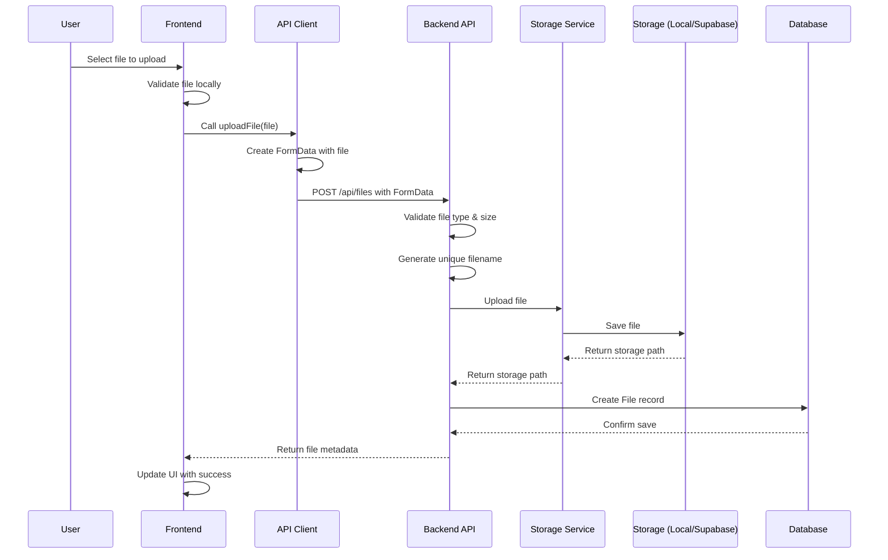
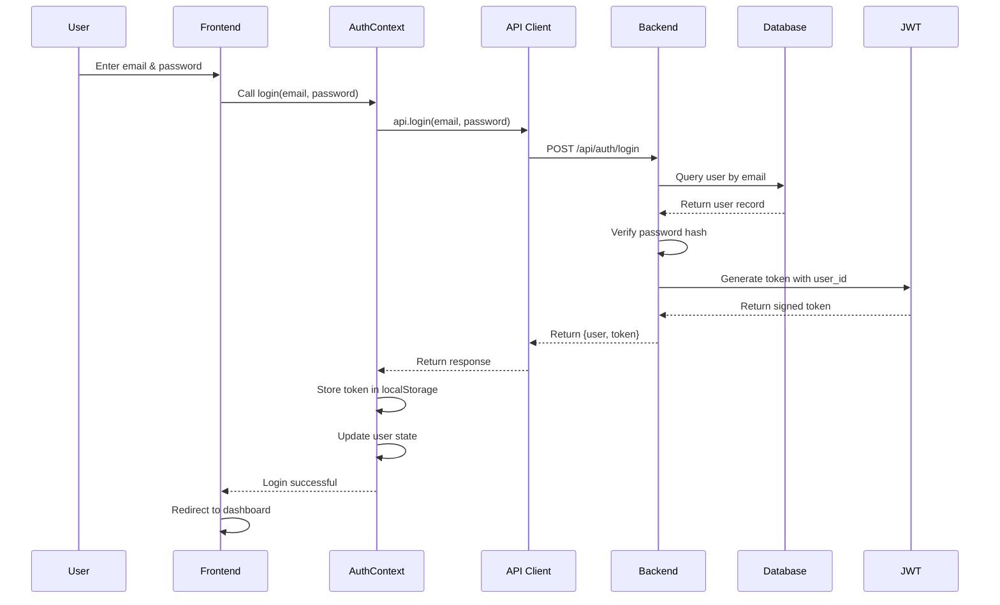
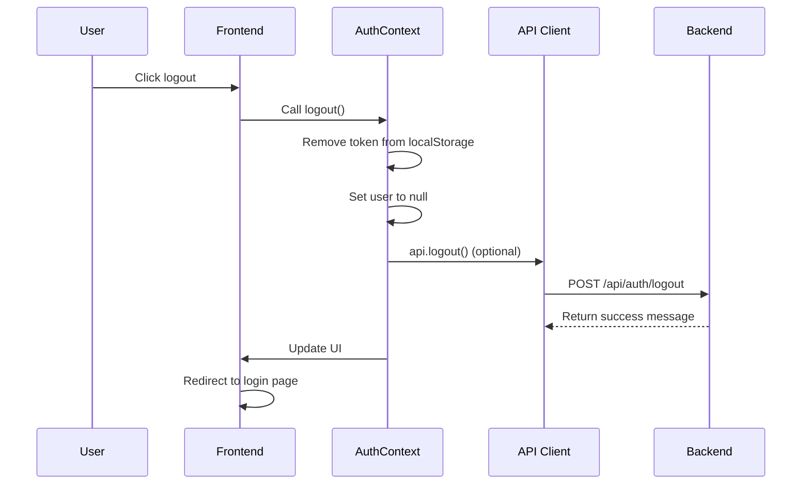
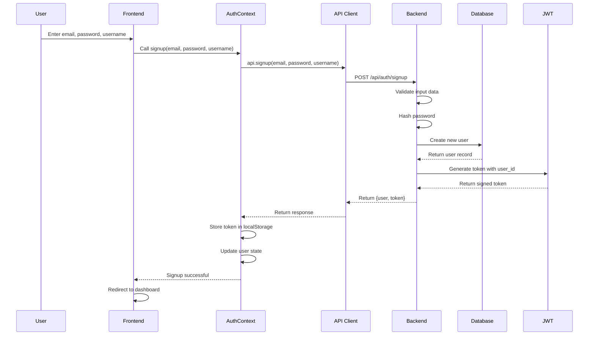
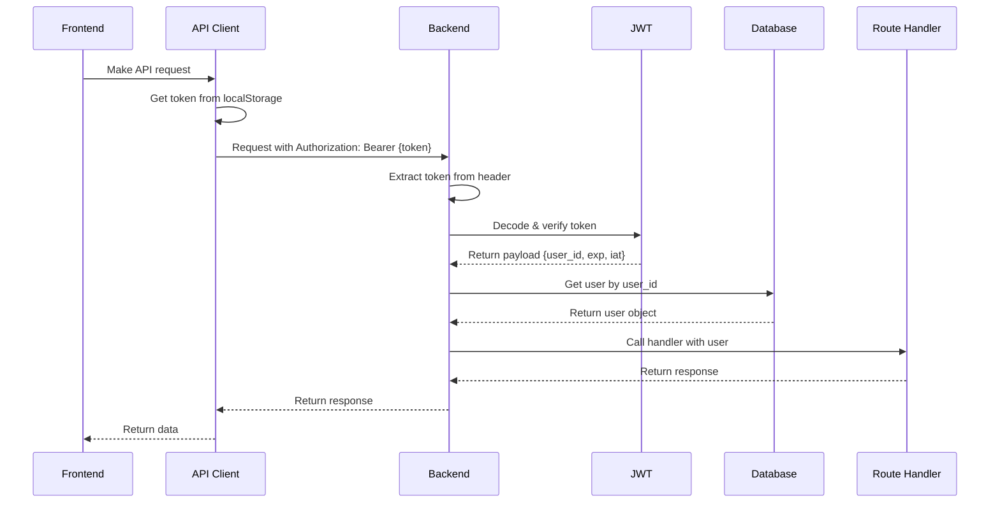
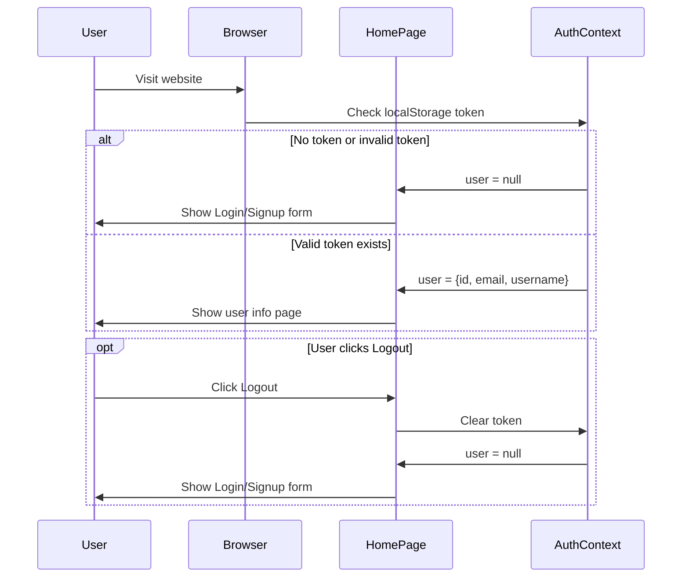

# Full Stack Application - Flask + Next.js

<p align="center">
  
</p>
A modern full-stack application with Python Flask backend and Next.js frontend, designed for deployment on Vercel.
This repo is **co-work with the roo code vs code extension with claude-4.5 llm models**.

## MVP status

| feature | done | Notes |
|------|---------|-------|
| Setup development environment | ✅  | Installed dependencies and configured environment |
| signup, login, logout | ✅  |  |
|  file upload, download, delete, pagination list |  ✅ |  |
|  file upload progress bar | ❌ |  |
|  file metadata modification(file title) | ✅ |  |
|Supabase free tier sql , storage usage|  ✅ |
| backend flask deployed to vercel serverless function  | ❌ |
| frontend next.js deploed to vercel | ❌   |
| vercel and github integration | ❌  |


## trade off and the future enhancmements

1. Simple JWT authentication with localStorage
the token only expired after 24 hours and no refresh mechanisms.

2. soft delete which make the file still occupy the storage spaces

3. no progress bar for file uploads

4. ** the demo still only run on local , not yet to the vercel or other cloud. **


## arcitecture and sequence diagrams

### file upload


### login


### logout


### signup


### authentication, happens on every flask login required route



### when the user need to login




## Tech Stack

### Backend
- Python 3.13
- Flask
- uv (Python package manager)
- Vercel Serverless Functions

### Frontend
- Next.js 14+
- React
- TypeScript
- Tailwind CSS

### Development
- Docker & Docker Compose
- Hot reloading for both frontend and backend

## Quick Start


### Using Scripts
```bash
# Setup with Docker
./setup.sh


```

### Using Supabase Backend

1. Create a `.env.production` file in the backend directory:
   ```bash
   cp backend/.env.production.example backend/.env.production
   # Edit the file and add your Supabase credentials
   ```

2. Start services with Supabase:
   ```bash
   make supabase-up
   ```

3. Initialize Supabase database:
   ```bash
   make supabase-db-init
   # Or use the initialization script:
   ./supabase-init.sh
   ```

4. Access the application:
   - Frontend: http://localhost:3000
   - Backend API: http://localhost:8000 (connected to Supabase)

### Manual Setup

#### Prerequisites
- Docker and Docker Compose (for containerized development)
- Node.js 18+ (for local frontend development)
- Python 3.13 (for local backend development)
- uv (Python package manager)

#### Local Development with Docker

1. Clone the repository
2. Run the setup script:
   ```bash
   ./setup.sh
   ```

3. Initialize the database:
   ```bash
   make docker-db-init
   ```

4. Access the applications:
   - Frontend: http://localhost:3000
   - Backend API: http://localhost:8000

#### Local Development without Docker

1. Run the development script:
   ```bash
   ./dev.sh
   # or
   make dev
   ```

2. Or manually set up each service:

   **Backend:**
   ```bash
   cd backend
   uv venv
   source .venv/bin/activate  # On Windows: .venv\Scripts\activate
   uv pip install -r requirements.txt
   cp .env.example .env
   python src/app.py
   ```

   **Frontend:**
   ```bash
   cd frontend
   npm install
   cp .env.example .env.local
   npm run dev
   ```

## Available Commands

### Make Commands
- `make help` - Show available commands
- `make setup` - Initial project setup
- `make dev` - Run development servers
- `make docker-up` - Start Docker containers
- `make docker-down` - Stop Docker containers
- `make docker-build` - Rebuild Docker containers
- `make docker-logs` - View Docker logs
- `make docker-db-init` - Initialize database tables
- `make supabase-up` - Start with Supabase backend
- `make supabase-down` - Stop Supabase containers
- `make supabase-db-init` - Initialize Supabase database
- `make clean` - Clean build artifacts
- `make test` - Run tests
- `make lint` - Run linters

### NPM Scripts (Frontend)
- `npm run dev` - Start development server
- `npm run build` - Build for production
- `npm run start` - Start production server
- `npm run lint` - Run ESLint
- `npm run type-check` - Run TypeScript checking

## Environment Variables

### Backend (.env)
```bash
FLASK_DEBUG=True
SECRET_KEY=your-secret-key-here
ENVIRONMENT=development
PORT=5000
ALLOWED_ORIGINS=http://localhost:3000,http://localhost:5000
```

### Frontend (.env.local)
```bash
NEXT_PUBLIC_API_URL=http://localhost:5000
NODE_ENV=development
```

## Deployment

Both frontend and backend are configured for deployment on Vercel.

### Backend Deployment
1. Deploy to Vercel:
   ```bash
   cd backend
   vercel
   ```

2. Set environment variables in Vercel dashboard

### Frontend Deployment
1. Deploy to Vercel:
   ```bash
   cd frontend
   vercel
   ```

2. Set the `NEXT_PUBLIC_API_URL` to your backend URL

## Testing

Run tests for both frontend and backend:
```bash
make test
```

Or individually:
```bash
# Backend tests
cd backend && python -m pytest

# Frontend tests
cd frontend && npm test
```

