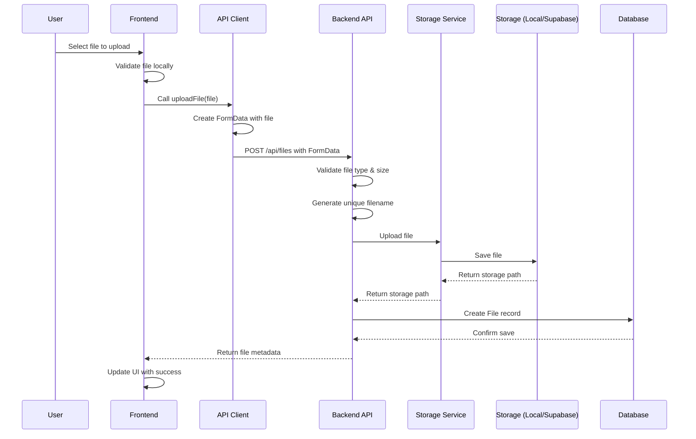
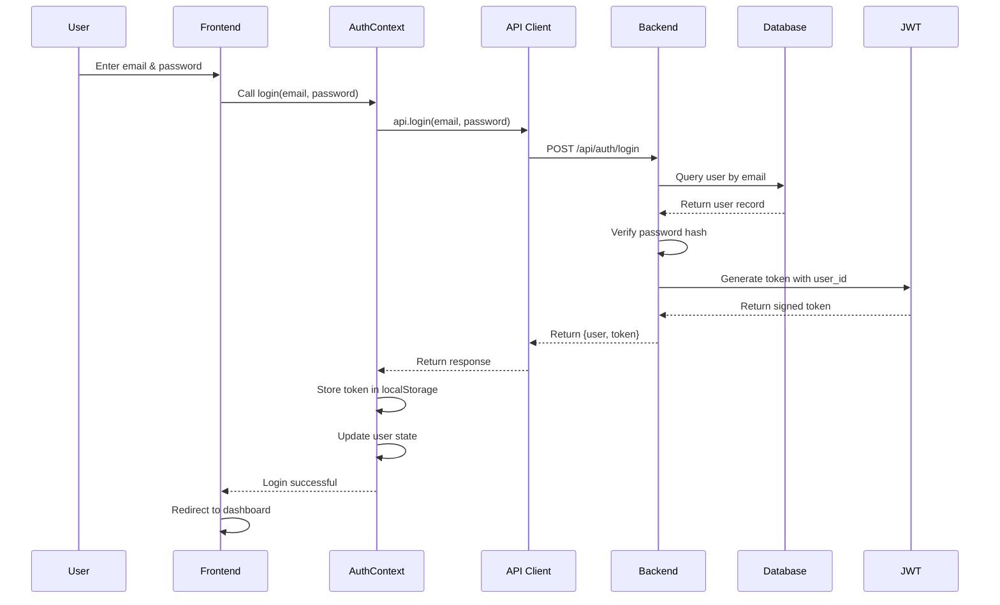
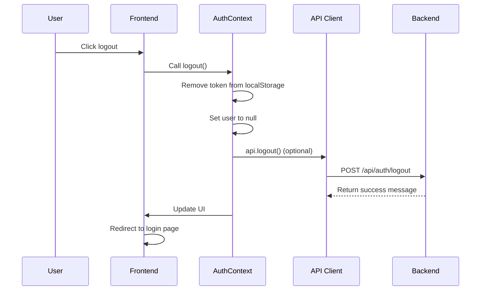
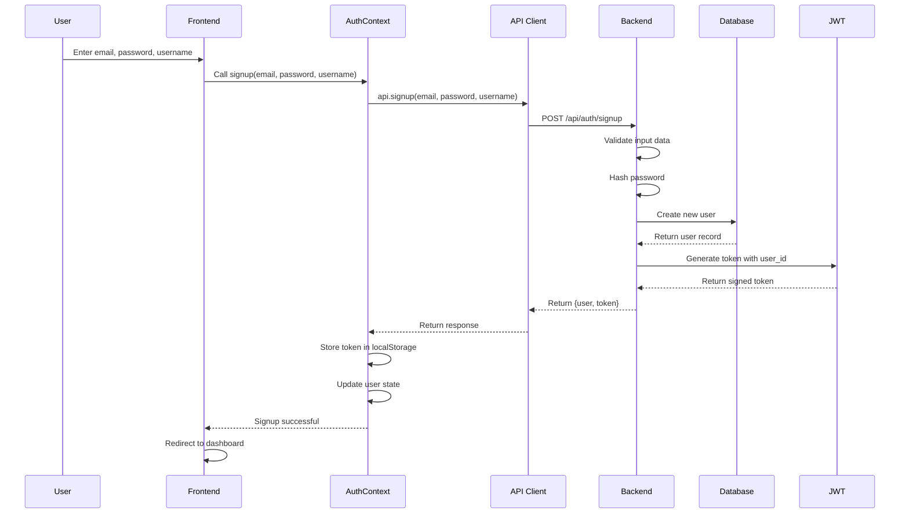
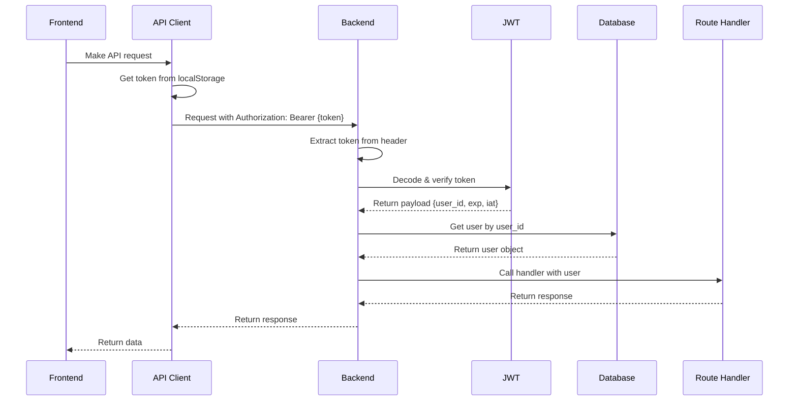
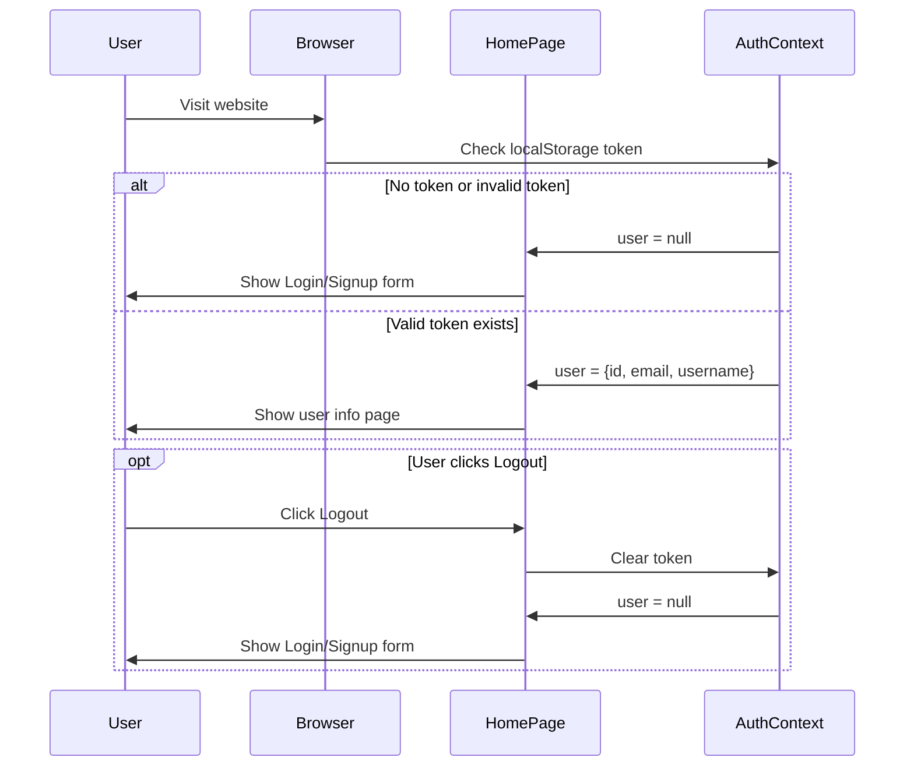

# Full Stack Application - Flask + Next.js

<p align="center">
  
</p>
A modern full-stack application with Python Flask backend and Next.js frontend, designed for deployment on Vercel.
This repo is **co-work with the roo code vs code extension with claude-4.5 llm models**.

## MVP status

| feature | done | Notes |
|------|---------|-------|
| Setup development environment | ✅  | Installed dependencies and configured environment |
| signup, login, logout | ✅  |  |
|  file upload, download, delete, pagination list |  ✅ |  |
|  file upload progress bar | ❌ |  |
|  file metadata modification(file title) | ✅ |  |
|Supabase free tier sql , storage usage|  ✅ |
| backend flask deployed to vercel serverless function  | ❌ |
| frontend next.js deploed to vercel | ❌   |
| vercel and github integration | ❌  |


## trade off and the future enhancmements

1. Simple JWT authentication with localStorage
the token only expired after 24 hours and no refresh mechanisms.

2. soft delete which make the file still occupy the storage spaces

3. no progress bar for file uploads

4. ** the demo still only run on local , not yet to the vercel or other cloud. **


## arcitecture and sequence diagrams

### file upload


### login


### logout


### signup


### authentication, happens on every flask login required route



### when the user need to login




## Tech Stack

### Backend
- Python 3.13
- Flask
- uv (Python package manager)
- Vercel Serverless Functions

### Frontend
- Next.js 14+
- React
- TypeScript
- Tailwind CSS

### Development
- Docker & Docker Compose
- Hot reloading for both frontend and backend

## Quick Start

### Prerequisites
- Docker and Docker Compose
- Git

### Development with Local PostgreSQL

1. Clone the repository and setup:
```bash
git clone <repository-url>
cd filemanageportal
./setup.sh
```

2. Start all services:
```bash
make docker-up
```

3. Initialize the database:
```bash
make docker-db-init
```

4. Access the application:
   - Frontend: http://localhost:3000
   - Backend API: http://localhost:8000

### Development with Supabase Backend

1. Create a `.env.production` file in the backend directory:
   ```bash
   cp backend/.env.production.example backend/.env.production
   # Edit the file and add your Supabase credentials
   ```

2. Start services with Supabase:
   ```bash
   make supabase-up
   ```

3. Initialize Supabase database:
   ```bash
   make supabase-db-init
   # Or use the initialization script:
   ./supabase-init.sh
   ```

4. Access the application:
   - Frontend: http://localhost:3000
   - Backend API: http://localhost:8000 (connected to Supabase)

### Stopping Services

```bash
# Stop local PostgreSQL setup
make docker-down

# Stop Supabase setup
make supabase-down
```

## Available Commands

### Docker Development Commands

**Local PostgreSQL:**
- `make setup` - Initial project setup with Docker
- `make docker-up` - Start all Docker containers
- `make docker-down` - Stop all Docker containers
- `make docker-build` - Rebuild Docker containers
- `make docker-logs` - View container logs
- `make docker-db-init` - Initialize database tables

**Supabase Backend:**
- `make supabase-up` - Start with Supabase backend
- `make supabase-down` - Stop Supabase containers
- `make supabase-db-init` - Initialize Supabase database

**Utilities:**
- `make clean` - Clean build artifacts
- `make test` - Run tests (inside containers)
- `make lint` - Run linters (inside containers)
- `make help` - Show all available commands

## Environment Variables

### Backend Configuration

**For Local PostgreSQL** (docker-compose.yml):
- Environment variables are set in the docker-compose.yml file
- Database URL: `postgresql://postgres:postgres@db:5432/filesvc`
- Backend runs on port 8000 (mapped from container port 5000)

**For Supabase** (docker-compose.supabase.yml):
- Create `backend/.env.production` from `backend/.env.production.example`
- Add your Supabase credentials (DATABASE_URL, SUPABASE_URL, SUPABASE_KEY)
- Storage mode automatically set to Supabase

### Frontend Configuration

Frontend environment is configured in docker-compose files:
- `NEXT_PUBLIC_API_URL=http://localhost:8000`
- Automatically connects to backend on port 8000

## Deployment

Both frontend and backend are configured for deployment on Vercel.

### Backend Deployment
1. Deploy to Vercel:
   ```bash
   cd backend
   vercel
   ```

2. Set environment variables in Vercel dashboard

### Frontend Deployment
1. Deploy to Vercel:
   ```bash
   cd frontend
   vercel
   ```

2. Set the `NEXT_PUBLIC_API_URL` to your backend URL

## Testing

Run tests inside Docker containers:
```bash
make test
```

This will execute tests for both frontend and backend within their respective containers.

## Troubleshooting

### Port Already in Use
If you see port conflict errors:
```bash
# Check what's using the ports
lsof -i :3000 -i :8000 -i :5432

# Stop any conflicting services
make docker-down
```

### Database Connection Issues
```bash
# Reinitialize the database
make docker-db-init

# Or for Supabase
make supabase-db-init
```

### Container Issues
```bash
# Rebuild containers from scratch
make docker-build
make docker-up
```

