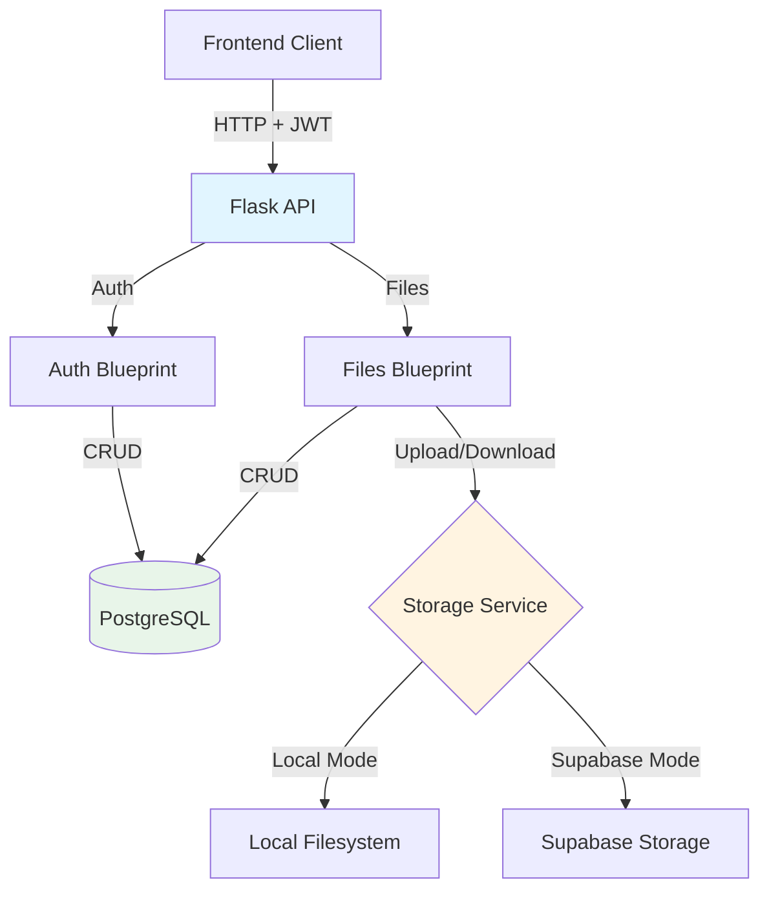
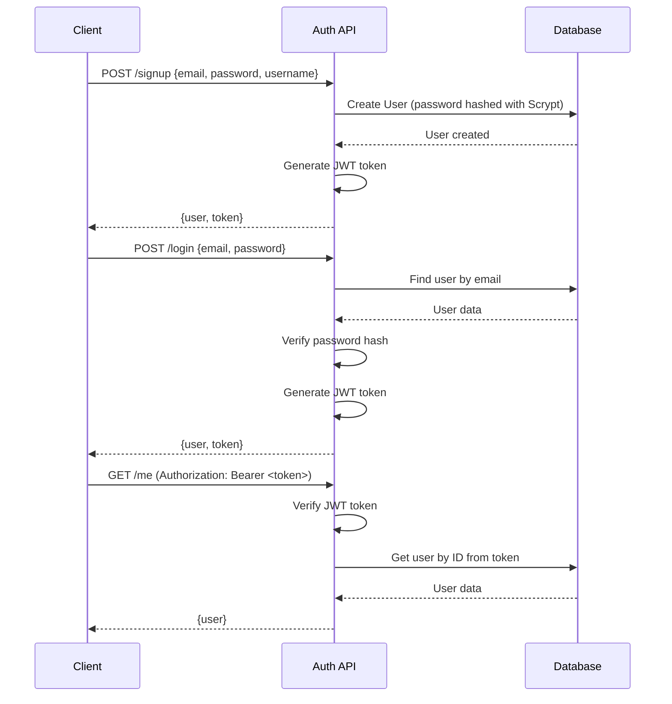
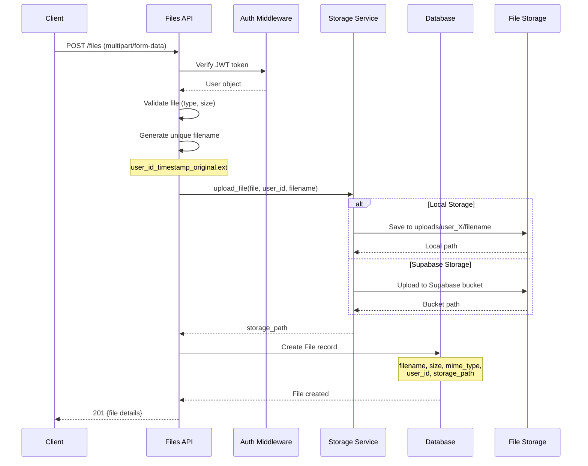
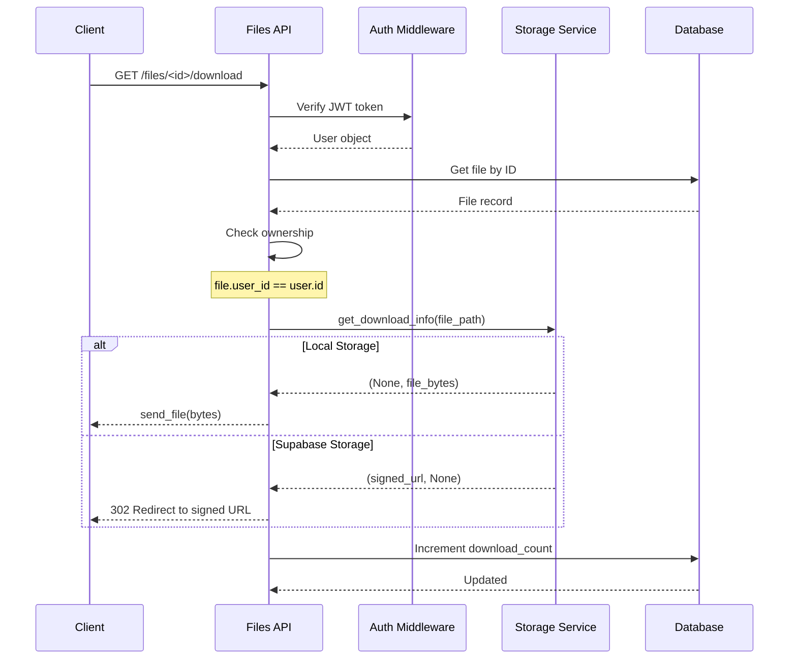

# Backend API Design Summary - File Management System

## Table of Contents

1. [Architecture Overview](#architecture-overview)
2. [Core Components](#core-components)
   - [Application Structure](#1-application-structure)
3. [API Endpoints](#api-endpoints)
   - [Authentication Endpoints](#authentication-endpoints)
   - [File Management Endpoints](#file-management-endpoints)
4. [File Upload Flow](#file-upload-flow)
5. [File Download Flow](#file-download-flow)
6. [Storage Service Architecture](#storage-service-architecture)
   - [Dual Storage Support](#dual-storage-support)
7. [Data Models](#data-models)
   - [User Model](#user-model)
   - [File Model](#file-model)
8. [Security Features](#security-features)
   - [Authentication & Authorization](#1-authentication--authorization)
   - [File Security](#2-file-security)
   - [Input Validation](#3-input-validation)
9. [API Response Patterns](#api-response-patterns)
   - [Success Responses](#success-responses)
   - [Error Responses](#error-responses)
10. [Pagination Strategy](#pagination-strategy)
11. [Key Design Decisions](#key-design-decisions)
12. [Performance Considerations](#performance-considerations)
    - [Potential N+1 Issues](#potential-n1-issues)
    - [Indexing Strategy](#indexing-strategy)
13. [Configuration Management](#configuration-management)
14. [Summary](#summary)

---

## Architecture Overview



---

## Core Components

### **1. Application Structure** ([`app.py`](filemanageportal/backend/src/app.py:1-143))

```python
Flask App
├── Configuration (from config.py)
├── Database (SQLAlchemy)
├── CORS (Cross-Origin Resource Sharing)
├── Blueprints
│   ├── auth_bp (/api/auth/*)
│   └── files_bp (/api/files/*)
└── Middleware
    └── JWT Authentication
```

**Key Features:**
- Environment-based configuration
- Structured logging (stdout for Vercel)
- Health check endpoint
- Database initialization endpoint (dev only)
- CORS support for frontend

---

## API Endpoints

### **Authentication Endpoints** ([`routes/auth.py`](filemanageportal/backend/src/routes/auth.py:1-250))

| Endpoint | Method | Auth | Description |
|----------|--------|------|-------------|
| `/api/auth/signup` | POST | ❌ | Register new user |
| `/api/auth/login` | POST | ❌ | Login and get JWT token |
| `/api/auth/logout` | POST | ✅ | Logout (client-side) |
| `/api/auth/me` | GET | ✅ | Get current user profile |
| `/api/auth/me` | PUT | ✅ | Update user profile |

**Authentication Flow:**



**Security Features:**
- Password hashing with **Scrypt** (600,000 iterations)
- JWT tokens for stateless authentication
- Email validation
- Password strength requirements (min 6 chars)
- Username uniqueness enforcement

---

### **File Management Endpoints** ([`routes/files.py`](filemanageportal/backend/src/routes/files.py:1-377))

| Endpoint | Method | Auth | Description |
|----------|--------|------|-------------|
| `/api/files` | POST | ✅ | Upload file |
| `/api/files` | GET | ✅ | List user's files (paginated) |
| `/api/files/<id>` | GET | ✅ | Get file details |
| `/api/files/<id>/download` | GET | ✅ | Download file |
| `/api/files/<id>` | PATCH | ✅ | Rename file |
| `/api/files/<id>` | DELETE | ✅ | Delete file (soft delete) |

---

## File Upload Flow



**Upload Features:**
- Multipart form-data support
- File type validation (configurable)
- File size limits (via `MAX_CONTENT_LENGTH`)
- Unique filename generation (prevents conflicts)
- User-specific storage paths
- Dual storage support (local/Supabase)

---

## File Download Flow



**Download Features:**
- Ownership verification
- Download counter tracking
- Signed URLs for Supabase (1 hour expiry)
- Direct file streaming for local storage
- Original filename preservation

---

## Storage Service Architecture

### **Dual Storage Support** ([`storage.py`](filemanageportal/backend/src/storage.py:1-337))

```python
StorageService
├── Mode Detection (env: STORAGE_MODE)
│   ├── local (default)
│   └── supabase
├── Local Storage
│   ├── uploads/ directory
│   └── user_X/ subdirectories
└── Supabase Storage
    ├── Bucket management
    ├── File upload
    ├── Signed URL generation
    └── File deletion
```

**Storage Modes:**

| Feature | Local Storage | Supabase Storage |
|---------|--------------|------------------|
| **Setup** | Create `uploads/` folder | Supabase credentials required |
| **Upload** | Save to filesystem | Upload to bucket via API |
| **Download** | Stream file bytes | Generate signed URL (1h) |
| **Path** | `uploads/user_X/filename` | `user_X/filename` in bucket |
| **Scalability** | Limited by disk | Unlimited (cloud) |
| **Cost** | Free (local disk) | Pay per GB |

**Configuration:**
```bash
# Local Storage (default)
STORAGE_MODE=local
UPLOAD_FOLDER=uploads

# Supabase Storage
STORAGE_MODE=supabase
SUPABASE_URL=https://xxx.supabase.co
SUPABASE_SERVICE_KEY=xxx
SUPABASE_STORAGE_BUCKET=files
```

---

## Data Models

### **User Model** ([`models.py`](filemanageportal/backend/src/models.py:11-50))

```python
User
├── id (PK)
├── username (unique, indexed)
├── email (unique, indexed)
├── password_hash (Scrypt)
├── created_at
├── updated_at
├── is_active
└── files (relationship → File)
    └── lazy='dynamic' (returns Query object)
    └── cascade='all, delete-orphan'
```

### **File Model** ([`models.py`](filemanageportal/backend/src/models.py:53-129))

```python
File
├── id (PK)
├── filename (unique storage name)
├── original_filename (user-visible name)
├── file_path (storage location)
├── file_size (bytes)
├── mime_type
├── file_hash (SHA-256, for deduplication)
├── user_id (FK → users.id, indexed)
├── owner (relationship → User)
├── description
├── tags (comma-separated)
├── uploaded_at (indexed)
├── updated_at
├── last_accessed_at
├── is_public
├── is_deleted (soft delete, indexed)
├── deleted_at
└── download_count
```

**Relationship:**
```python
# One-to-Many: User → Files
User.files ←→ File.owner (bidirectional)
```

---

## Security Features

### **1. Authentication & Authorization**

```python
@login_required  # Decorator on all protected endpoints
def endpoint(user):  # User object injected
    # Verify ownership
    if file.user_id != user.id:
        return 403 Forbidden
```

**JWT Token Structure:**
```json
{
  "user_id": 123,
  "exp": 1234567890  // Expiration timestamp
}
```

### **2. File Security**

| Feature | Implementation |
|---------|----------------|
| **Filename Sanitization** | `secure_filename()` from Werkzeug |
| **Unique Naming** | `{user_id}_{timestamp}_{original}` |
| **User Isolation** | Files stored in `user_X/` directories |
| **Ownership Check** | Every operation verifies `file.user_id == user.id` |
| **Soft Delete** | Files marked as deleted, not physically removed |

### **3. Input Validation**

```python
# Email validation
if '@' not in email or '.' not in email:
    return 400

# Password strength
if len(password) < 6:
    return 400

# File type validation
if not allowed_file(filename, ALLOWED_EXTENSIONS):
    return 400

# File size limit
MAX_CONTENT_LENGTH = 100 * 1024 * 1024  # 100MB
```

---

## API Response Patterns

### **Success Responses**

```json
// 201 Created (Upload)
{
  "message": "File uploaded successfully",
  "file": {
    "id": 1,
    "filename": "document.pdf",
    "size": 1024000,
    "mime_type": "application/pdf",
    "uploaded_at": "2025-11-17T03:26:34.582Z"
  }
}

// 200 OK (List)
{
  "files": [...],
  "pagination": {
    "page": 1,
    "size": 10,
    "total": 42,
    "pages": 5,
    "has_next": true,
    "has_prev": false
  }
}
```

### **Error Responses**

```json
// 400 Bad Request
{
  "error": "No file provided"
}

// 401 Unauthorized
{
  "error": "Invalid or expired token"
}

// 403 Forbidden
{
  "error": "Not authorized to access this file"
}

// 404 Not Found
{
  "error": "File not found"
}

// 500 Internal Server Error
{
  "error": "Failed to upload file",
  "message": "Detailed error message",
  "type": "IOError"
}
```

---

## Pagination Strategy

```python
# Query parameters
page = request.args.get('page', 1, type=int)
size = request.args.get('size', 10, type=int)
size = min(size, 100)  # Max 100 items per page

# SQLAlchemy pagination
pagination = File.query.filter_by(
    user_id=user.id,
    is_deleted=False
).order_by(desc(File.uploaded_at)).paginate(
    page=page,
    per_page=size,
    error_out=False
)
```

**Benefits:**
- Prevents loading all files at once
- Reduces memory usage
- Faster response times
- Client-controlled page size

---

## Key Design Decisions

### **1. Soft Delete**
- Files marked as `is_deleted=True` instead of physical deletion
- Allows recovery and audit trails
- Storage cleanup can be done separately

### **2. Dual Filename Storage**
- `filename`: Unique storage name (prevents conflicts)
- `original_filename`: User-visible name (UX)

### **3. User-Specific Paths**
- `user_X/` directories isolate user data
- Easier to manage quotas and permissions
- Simplifies backup/restore

### **4. Download Counter**
- Tracks file popularity
- Can be used for analytics
- Incremented on every download

### **5. Lazy Loading for Files**
- `User.files` uses `lazy='dynamic'`
- Returns Query object, not loaded list
- Allows filtering and pagination
- Prevents N+1 queries

---

## Performance Considerations

### **Potential N+1 Issues**

```python
# ❌ Bad: N+1 problem
files = File.query.all()
for file in files:
    print(file.owner.username)  # Triggers query for each file

# ✅ Good: Use joinedload
from sqlalchemy.orm import joinedload
files = File.query.options(joinedload(File.owner)).all()
for file in files:
    print(file.owner.username)  # No extra queries
```

### **Indexing Strategy**

```python
# Indexed columns for fast queries
user_id = db.Column(..., index=True)  # File ownership lookups
uploaded_at = db.Column(..., index=True)  # Sorting by date
is_deleted = db.Column(..., index=True)  # Filtering deleted files
file_hash = db.Column(..., index=True)  # Deduplication lookups
```

---

## Configuration Management

```python
# Environment-based config
class Config:
    SQLALCHEMY_DATABASE_URI = os.getenv('DATABASE_URL')
    SECRET_KEY = os.getenv('SECRET_KEY')
    MAX_CONTENT_LENGTH = int(os.getenv('MAX_FILE_SIZE', 100 * 1024 * 1024))
    ALLOWED_EXTENSIONS = set(os.getenv('ALLOWED_EXTENSIONS', '').split(','))
    CORS_ORIGINS = os.getenv('CORS_ORIGINS', '*').split(',')
```

**Environment Variables:**
- `DATABASE_URL`: PostgreSQL connection string
- `SECRET_KEY`: JWT signing key
- `MAX_FILE_SIZE`: Upload size limit
- `STORAGE_MODE`: local or supabase
- `LOG_LEVEL`: DEBUG, INFO, WARNING, ERROR

---

## Summary

**Strengths:**
✅ Clean separation of concerns (blueprints, services)
✅ Dual storage support (local + cloud)
✅ Strong security (JWT, ownership checks, password hashing)
✅ Comprehensive error handling
✅ Pagination support
✅ Soft delete for data recovery
✅ Detailed logging

**Areas for Enhancement:**
⚠️ Add rate limiting to prevent abuse
⚠️ Implement file deduplication using `file_hash`
⚠️ Add file sharing functionality (commented out in models