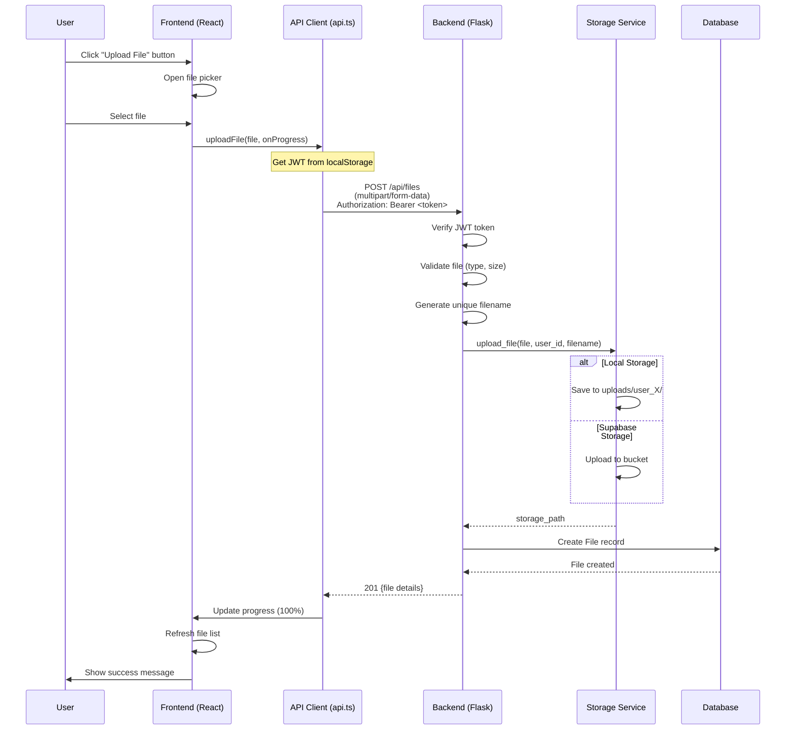

# How the API Design Enables File Upload from Frontend

## Complete Upload Flow



---

## Step-by-Step Breakdown

### **1. Frontend UI** ([`files/page.tsx:158-206`](filemanageportal/frontend/src/app/files/page.tsx:158-206))

```tsx
{/* Hidden file input */}
<input
  ref={fileInputRef}
  type="file"
  onChange={handleFileUpload}  // ← Triggered when user selects file
  disabled={uploading}
  className="hidden"
  id="file-upload"
/>

{/* Visible upload button */}
<label htmlFor="file-upload" className="cursor-pointer ...">
  Upload File
</label>
```

**User Action:** Click "Upload File" → Browser opens file picker → User selects file

---

### **2. Frontend Handler** ([`files/page.tsx:50-75`](filemanageportal/frontend/src/app/files/page.tsx:50-75))

```tsx
const handleFileUpload = async (e: React.ChangeEvent<HTMLInputElement>) => {
  const file = e.target.files?.[0];  // ← Get selected file
  if (!file) return;

  try {
    setUploading(true);
    setUploadProgress(0);
    
    // Call API with progress callback
    await api.uploadFile(file, (progress) => {
      setUploadProgress(Math.round(progress));  // ← Update progress bar
    });
    
    setSuccess('File uploaded successfully!');
    loadFiles();  // ← Refresh file list
  } catch (err) {
    setError(err.message);
  } finally {
    setUploading(false);
  }
};
```

**Key Features:**
- ✅ Progress tracking with callback
- ✅ Error handling
- ✅ Auto-refresh file list after upload
- ✅ Reset form after success

---

### **3. API Client** ([`api.ts:124-176`](filemanageportal/frontend/src/lib/api.ts:124-176))

```typescript
async uploadFile(
  file: File,
  onProgress?: (progress: number) => void
): Promise<FileUploadResponse> {
  // 1. Create FormData (multipart/form-data)
  const formData = new FormData();
  formData.append('file', file);  // ← Add file to form data

  // 2. Get JWT token from localStorage
  const token = localStorage.getItem('token');

  // 3. Use XMLHttpRequest for progress tracking
  return new Promise((resolve, reject) => {
    const xhr = new XMLHttpRequest();

    // Track upload progress
    if (onProgress) {
      xhr.upload.addEventListener('progress', (event) => {
        if (event.lengthComputable) {
          const percentComplete = (event.loaded / event.total) * 100;
          onProgress(percentComplete);  // ← Call progress callback
        }
      });
    }

    xhr.addEventListener('load', () => {
      const data = JSON.parse(xhr.responseText);
      if (xhr.status >= 200 && xhr.status < 300) {
        resolve(data);  // ← Success
      } else {
        reject(new Error(data.error));  // ← Error
      }
    });

    // 4. Send request
    xhr.open('POST', `${this.baseUrl}/api/files`);
    
    // 5. Add JWT token to Authorization header
    if (token) {
      xhr.setRequestHeader('Authorization', `Bearer ${token}`);
    }

    // 6. Send FormData
    xhr.send(formData);
  });
}
```

**Why XMLHttpRequest instead of fetch?**
- ✅ `fetch()` doesn't support upload progress tracking
- ✅ `XMLHttpRequest` provides `upload.progress` event
- ✅ Allows real-time progress bar updates

---

### **4. Backend Endpoint** ([`routes/files.py:25-137`](filemanageportal/backend/src/routes/files.py:25-137))

```python
@files_bp.route('', methods=['POST'])
@login_required  # ← Verify JWT token, inject user object
def upload_file(user):
    # 1. Check if file is in request
    if 'file' not in request.files:
        return jsonify({'error': 'No file provided'}), 400
    
    file = request.files['file']
    
    # 2. Validate file
    if file.filename == '':
        return jsonify({'error': 'No file selected'}), 400
    
    # 3. Check file type (if configured)
    allowed_extensions = current_app.config.get('ALLOWED_EXTENSIONS')
    if allowed_extensions and not allowed_file(file.filename, allowed_extensions):
        return jsonify({'error': 'File type not allowed'}), 400
    
    try:
        # 4. Secure the filename
        original_filename = secure_filename(file.filename)
        
        # 5. Generate unique filename
        timestamp = datetime.utcnow().strftime('%Y%m%d_%H%M%S')
        filename = f"{user.id}_{timestamp}_{original_filename}"
        
        # 6. Upload to storage (local or Supabase)
        storage = get_storage_service()
        storage_path = storage.upload_file(file, user.id, filename)
        
        # 7. Get file size
        file.seek(0, 2)  # Seek to end
        file_size = file.tell()
        file.seek(0)  # Reset
        
        # 8. Create database record
        new_file = File(
            filename=filename,
            original_filename=original_filename,
            file_path=storage_path,
            file_size=file_size,
            mime_type=file.content_type,
            user_id=user.id  # ← Associate with authenticated user
        )
        
        db.session.add(new_file)
        db.session.commit()
        
        # 9. Return success response
        return jsonify({
            'message': 'File uploaded successfully',
            'file': {
                'id': new_file.id,
                'filename': new_file.original_filename,
                'size': new_file.file_size,
                'mime_type': new_file.mime_type,
                'uploaded_at': new_file.uploaded_at.isoformat()
            }
        }), 201
        
    except Exception as e:
        db.session.rollback()
        return jsonify({'error': 'Failed to upload file'}), 500
```

---

## Key Design Features

### **1. Authentication via JWT**

```typescript
// Frontend: Add token to request
xhr.setRequestHeader('Authorization', `Bearer ${token}`);
```

```python
# Backend: Verify token and get user
@login_required  # Decorator extracts user from JWT
def upload_file(user):  # User object injected
    # user.id is available for file ownership
```

### **2. Multipart Form Data**

```typescript
// Frontend: Create FormData
const formData = new FormData();
formData.append('file', file);  // Binary file data
```

```python
# Backend: Extract file from request
file = request.files['file']  # Flask automatically parses multipart
```

### **3. Progress Tracking**

```typescript
// Frontend: Track upload progress
xhr.upload.addEventListener('progress', (event) => {
  const percentComplete = (event.loaded / event.total) * 100;
  onProgress(percentComplete);  // Update UI
});
```

```tsx
// UI: Display progress bar
<div style={{ width: `${uploadProgress}%` }}></div>
<p>{uploadProgress}% uploaded</p>
```

### **4. File Ownership**

```python
# Backend: Associate file with user
new_file = File(
    user_id=user.id,  # ← From JWT token
    filename=filename,
    ...
)
```

**Security:** Users can only upload files to their own account (enforced by JWT).

### **5. Unique Filename Generation**

```python
# Backend: Prevent filename conflicts
timestamp = datetime.utcnow().strftime('%Y%m%d_%H%M%S')
filename = f"{user.id}_{timestamp}_{original_filename}"
# Example: 123_20251203_143000_document.pdf
```

### **6. Dual Storage Support**

```python
# Backend: Flexible storage
storage = get_storage_service()  # Returns local or Supabase
storage_path = storage.upload_file(file, user.id, filename)

# Local: uploads/user_123/123_20251203_143000_document.pdf
# Supabase: user_123/123_20251203_143000_document.pdf (in bucket)
```

---

## Security Measures

| Layer | Security Feature |
|-------|-----------------|
| **Authentication** | JWT token required (401 if missing/invalid) |
| **Authorization** | File associated with authenticated user only |
| **Filename** | `secure_filename()` prevents path traversal |
| **File Type** | Optional whitelist validation |
| **File Size** | `MAX_CONTENT_LENGTH` limit (100MB default) |
| **User Isolation** | Files stored in `user_X/` directories |

---

## Error Handling

### **Frontend:**
```tsx
try {
  await api.uploadFile(file, onProgress);
  setSuccess('File uploaded successfully!');
} catch (err) {
  setError(err.message);  // Display error to user
}
```

### **Backend:**
```python
try:
    storage_path = storage.upload_file(file, user.id, filename)
    db.session.commit()
    return jsonify({...}), 201
except Exception as e:
    db.session.rollback()  # Rollback database changes
    return jsonify({'error': 'Failed to upload file'}), 500
```

---

## Summary

**The API design enables file upload through:**

1. ✅ **JWT Authentication** - Secure, stateless user identification
2. ✅ **Multipart Form Data** - Standard HTTP file upload protocol
3. ✅ **Progress Tracking** - Real-time feedback via XMLHttpRequest
4. ✅ **Automatic User Association** - Files linked to authenticated user
5. ✅ **Flexible Storage** - Supports local filesystem or cloud (Supabase)
6. ✅ **Error Handling** - Comprehensive validation and error messages
7. ✅ **Security** - Multiple layers of protection

**User Experience:**
- Click button → Select file → See progress bar → Get confirmation → File appears in list

**Developer Experience:**
- Simple API: `api.uploadFile(file, onProgress)`
- Automatic authentication via stored JWT
- Built-in progress tracking
- Clear error messages